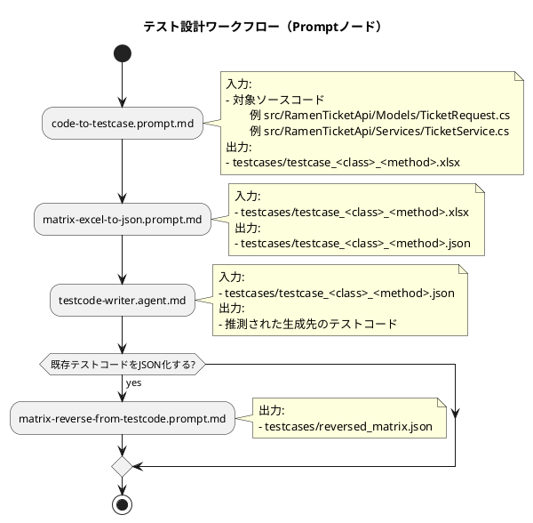

# テスト設計ツール

このリポジトリは、`prompts` と `scripts` のみで運用します。

- プロンプト定義: `.github/prompts/*.prompt.md`
- 実行スクリプト: `.github/prompts/scripts/*.py`

## 主な機能

- 指定コードから因子/水準とペアワイズのテストケースを設計し、Excel化する
- 「因子と水準」「テストケース」構成のExcelをJSONへ変換する
- testcase JSON（workbook形式）からテストコードを反映する
- 既存テストコード（DataRowベース）からJSONマトリクスを逆生成する

## JSONフォーマット（ワークブック）

`matrix-excel-to-json` で出力されるJSONは次の形式です。
出力ファイル名は、入力Excelと同名で拡張子のみ `.json` にします。

```json
{
	"sheets": [
		{
			"name": "因子と水準",
			"columns": ["因子", "水準1", "水準2", "水準3", "備考"],
			"rows": [
				{
					"因子": "Soup",
					"水準1": "塩",
					"水準2": "醤油",
					"水準3": "味噌",
					"備考": "必須"
				}
			]
		},
		{
			"name": "テストケース",
			"columns": ["ID", "Soup", "NoodleThickness", "NoodleAmount", "expected", "memo"],
			"rows": [
				{
					"ID": "TC-001",
					"Soup": "塩",
					"NoodleThickness": "細麺",
					"NoodleAmount": "普通",
					"expected": "200 OK / 食券1",
					"memo": "pairwise(valid)"
				}
			]
		}
	]
}
```

## 使い方（推奨）

Copilot Agent に次のように依頼します。

- 「コードからテストケースを設計して（Excelまで）」
- 「ワークブックExcelをJSONへ変換して」
- 「testcase JSON からテストコードを作って（testcode-writer）」
- 「既存のテストコードからテストマトリクスJSONを作って」

## スラッシュコマンド

- `/code-to-testcase`: 指定コードの入出力から因子/水準を抽出し、ペアワイズ結果を `testcases/testcase_<class>_<method>.xlsx` 形式（`testcase_` 必須）で出力する
- `/matrix-sample-excel`: prompts/scripts のサンプルExcelを作成する
- `/matrix-excel-to-json`: 因子/テストケースExcelをワークブックJSONへ変換する
- `/matrix-reverse-from-testcode`: 既存テストコード（DataRowベース）からテストマトリクスJSONを逆生成する

## 役割分離

- テストケース作成（設計フェーズ）: `/code-to-testcase` → `/matrix-excel-to-json`
- テストコード作成（実装フェーズ）: `testcode-writer`（直接呼び出し）

`testcode-writer` は、`testcases/testcase_*.json`（workbook形式）を唯一の前提入力として扱い、テストコード反映のみを担当します。

## ワークフロー



### ノードに渡す前提ファイル

- `/code-to-testcase`: 対象ソースコード（例: `src/RamenTicketApi/Models/TicketRequest.cs`, `src/RamenTicketApi/Services/TicketService.cs`）
- `/matrix-excel-to-json`: `testcases/testcase_<class>_<method>.xlsx`（`testcase_` 接頭辞）
- `testcode-writer`: `testcases/testcase_<class>_<method>.json`（workbook形式、`sheets` 配列）
- `/matrix-reverse-from-testcode`: 既存テストコードファイル（DataRowベース）
