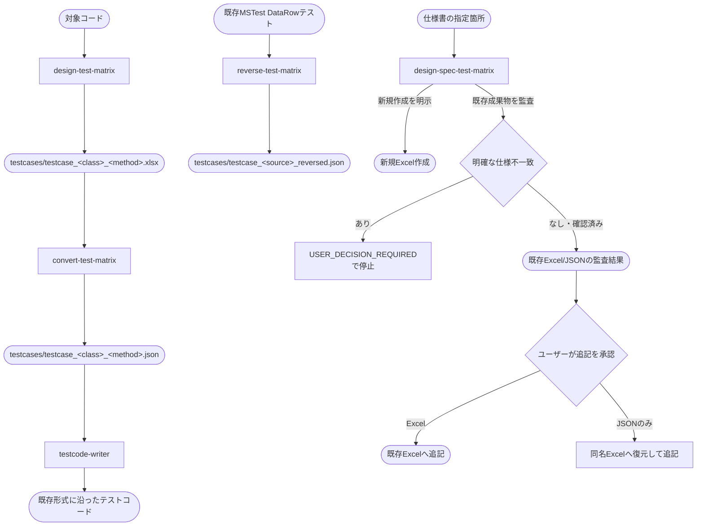

# テスト設計ツール

コードまたは仕様書からテストケースを設計し、Excel・JSON・テストコードへ段階的に反映するCodex向けカスタムエージェント集です。各プロジェクトへ `.codex/` を手動配置して利用します。

## 配置

このリポジトリの `.codex` フォルダを対象プロジェクトのルートへコピーします。

```text
target-project/
├── .codex/
│   ├── agents/
│   │   ├── design-test-matrix.toml
│   │   ├── design-spec-test-matrix.toml
│   │   ├── convert-test-matrix.toml
│   │   ├── testcode-writer.toml
│   │   └── reverse-test-matrix.toml
│   └── scripts/
│       ├── workbook_excel_to_json.py
│       ├── workbook_json_to_excel.py
│       ├── validate_workbook_json.py
│       ├── testcode_to_workbook_json.py
│       └── requirements.txt
└── AGENTS.md
```

Excel変換にはPythonと `openpyxl` が必要です。

```bash
python3 -m pip install -r .codex/scripts/requirements.txt
```

対象プロジェクトに既存の `.codex` がある場合は、フォルダ全体を上書きせず `agents/` と `scripts/` の内容をマージしてください。`AGENTS.md` の運用ルールも必要に応じて対象プロジェクトへ追記します。

## エージェント一覧

| エージェント | 入力 | 出力 |
| --- | --- | --- |
| `design-test-matrix` | コードまたはフォルダ | `testcases/testcase_*.xlsx` |
| `design-spec-test-matrix` | 仕様書の指定箇所、任意で既存Excel/JSON | 新規または追記した `.xlsx`、もしくは読取専用の監査結果 |
| `convert-test-matrix` | `testcases/testcase_*.xlsx` | 同名の `.json` |
| `testcode-writer` | `testcases/testcase_*.json` | テストコード |
| `reverse-test-matrix` | MSTest DataRowコード | `testcases/testcase_*_reversed.json` |

## 基本ワークフロー

各工程は独立しており、自動では連鎖しません。Codexへエージェント名と対象パスを明示します。

```text
design-test-matrix エージェントに src/TicketService.cs のテストケースExcelを作成させてください。
```

```text
convert-test-matrix エージェントに testcases/testcase_ticketservice_resolveexpected.xlsx をJSONへ変換させてください。
```

```text
testcode-writer エージェントに testcases/testcase_ticketservice_resolveexpected.json からテストを実装させてください。
```

既存テストをマトリクス化する場合は次のように依頼します。

```text
reverse-test-matrix エージェントに src/Example.Tests/TicketServiceTests.cs をJSONへ逆生成させてください。
```

## 仕様書起点のワークフロー

仕様書起点では、ファイルだけでなく対象の見出し・ページ・行範囲なども指定します。エージェントは対象箇所を内部的にGherkinへ整理しますが、`.feature` は保存しません。仕様に明記された判定表や具体例は削減せず、Excelの各ケースへ対応させます。

新規にExcelを作成する例:

```text
design-spec-test-matrix エージェントに Spec/APIプロジェクト概要.md の
「2. アプリ機能仕様（TicketService）」からテストケースExcelを作成させてください。
```

既存成果物を監査する例:

```text
design-spec-test-matrix エージェントに Spec/APIプロジェクト概要.md の
「2. アプリ機能仕様（TicketService）」を根拠として、
testcases/testcase_ticketservice_resolveexpected.xlsx の網羅性を監査させてください。
```

監査は成果物を変更せず、各仕様シナリオを「網羅済み」「不足」「期待値競合」「仕様が曖昧」に分類し、既存ケースのうち指定箇所では判断できないものを「指定箇所の対象外」として報告します。

同じ入力に対する期待値が明確に異なる場合や、仕様の対象機能・主要因子が既存ケースと対応しない場合は、仕様書の箇所または比較対象を取り違えた可能性があります。この場合は通常の監査結果や追記判断より先に通知し、次のいずれかが選択されるまで停止します。

- 指定仕様は正しいものとして監査を続ける。
- 仕様書の箇所を指定し直す。
- 比較対象のExcel/JSONを指定し直す。

単なる不足ケース、既存側だけの追加ケース、表記差は指定誤りとして扱いません。指定仕様が正しいと確認されても、競合する既存期待値は自動変更せず、監査結果として残します。

選択UIを利用できない場合は、次の形式で質問して停止します。カスタムエージェントがサブエージェントとして動作している場合は、親エージェントがこの内容をユーザーへ提示します。

```text
USER_DECISION_REQUIRED
理由: 指定仕様と既存テストケースに明確な不一致があります。
変更: 未実施
選択肢:
1. 指定仕様は正しいため、既存テストとの差異として監査を続ける。
2. 仕様書の箇所を指定し直す。
3. 比較対象のExcel/JSONを指定し直す。
回答方法: 選択肢の番号。必要な場合は新しいパスまたは対象箇所も指定してください。
```

不足ケースを追記する場合も、監査結果を提示した後にユーザー判断を求めます。不足候補には仕様上の順序で `GAP-001` から始まる選択用IDを付けます。これは監査中だけの識別子で、Excelへ追記するときに採番する正式な `TC-*` IDとは異なります。

- Excelがある場合: 全不足ケースを追記、指定GAP IDだけ追記、報告のみ。
- JSONだけがある場合: 同名Excelを生成して全件追記、指定GAP IDだけ追記、報告のみ。
- ExcelもJSONもない場合: 仕様から新規Excelを生成、報告のみ。

最初から新規Excel作成を明示した依頼では、生成可否を重ねて質問しません。いずれの確認でも、回答前は成果物を変更せず、回答後も操作直前に仕様と成果物を再読込します。内容が変わっていれば再監査して停止します。

```text
直前の監査で不足とされたケースを、
testcases/testcase_ticketservice_resolveexpected.xlsx へ追記してください。
```

新しい因子列が必要な場合、エージェントはExcelを変更せず、必要な構造変更を提案します。期待結果を仕様から確定できないケースは `expected` を `要確認` として残すため、解決するまで `testcode-writer` は実装を開始しません。

監査対象がJSONだけの場合、監査はJSONを直接読みます。同名Excelの生成と追記が選択されると、次のスクリプトでExcelを復元し、そのExcelへ不足ケースを追加します。元JSONは変更されません。

```bash
python3 .codex/scripts/workbook_json_to_excel.py \
  --input testcases/testcase_ticketservice_resolveexpected.json
```

追記後のJSONが必要な場合は、`convert-test-matrix` を別工程として実行します。監査、追記、JSON再生成は自動連鎖しません。


```mermaid
flowchart TD
    A(["対象コード"]) --> B["design-test-matrix"]
    B --> C(["testcases/testcase_&lt;class&gt;_&lt;method&gt;.xlsx"])
    C --> D["convert-test-matrix"]
    D --> E(["testcases/testcase_&lt;class&gt;_&lt;method&gt;.json"])
    E --> F["testcode-writer"]
    F --> G(["既存形式に沿ったテストコード"])

    H(["既存MSTest DataRowテスト"]) --> I["reverse-test-matrix"]
    I --> J(["testcases/testcase_&lt;source&gt;_reversed.json"])

    K(["仕様書の指定箇所"]) --> L["design-spec-test-matrix"]
    L -->|新規作成を明示| M(["新規Excel作成"])
    L -->|既存成果物を監査| R{"明確な仕様不一致"}
    R -->|あり| S["USER_DECISION_REQUIREDで停止"]
    R -->|なし・確認済み| N(["既存Excel/JSONの監査結果"])
    N --> O{"ユーザーが追記を承認"}
    O -->|Excel| P(["既存Excelへ追記"])
    O -->|JSONのみ| Q["同名Excelへ復元して追記"]
```

## データ契約

ExcelとJSONは次の2シートを持ちます。

- `因子と水準`
- `テストケース`

`因子と水準` の列は `因子`、`水準`、`備考` です。1つの水準を1行で表し、同じ因子の水準は複数行に分けます。

| 因子 | 水準 | 備考 |
| --- | --- | --- |
| Soup | 塩 | 有効値 |
| Soup | 醤油 | 有効値 |
| Soup | 味噌 | 有効値 |
| NoodleAmount | 普通 | 有効値 |
| NoodleAmount | 大盛り | 有効値 |

`テストケース` の列は `ID`、1列以上の因子列、`expected`、`memo` です。JSONは同じ内容をworkbook形式の `sheets` 配列で表現します。

仕様起点のケースでは、`memo` に仕様書パス、対象箇所、内部シナリオ名を記録して根拠を追跡できるようにします。既存のシート構成や列契約は変更しません。

逆生成では、既存DataRowに実際に現れる値だけから `因子と水準` を復元します。元のテストコードから判定できない未使用水準や設計意図は補完しません。

## 開発時の検証

変換スクリプトのテストは次で実行できます。

```bash
python3 -m unittest discover -s .codex/scripts -p 'test_*.py' -v
```
