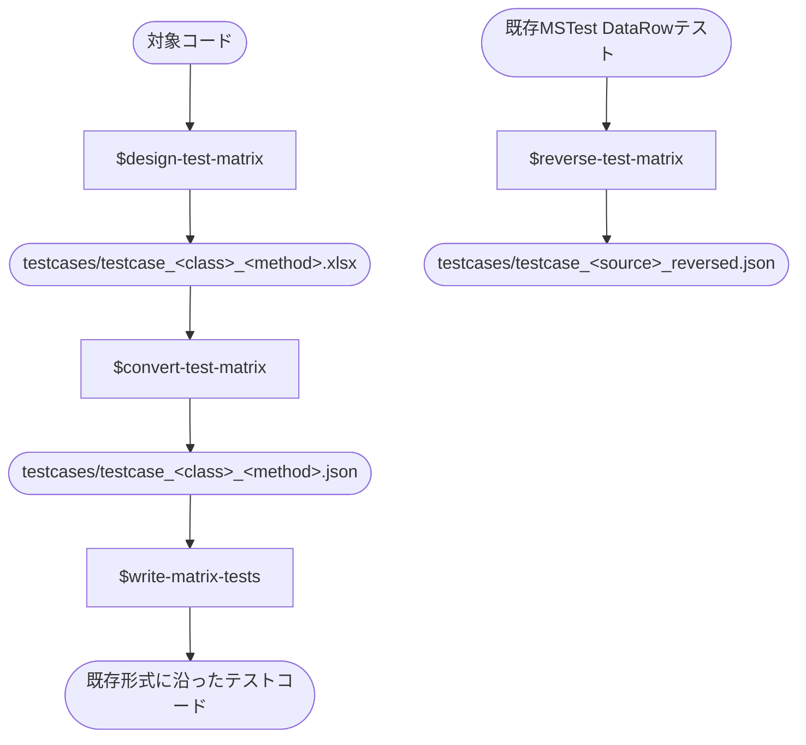

# テスト設計ツール

コードからテストケースを設計し、Excel・JSON・テストコードへ段階的に反映するCodex向けツールです。Codex Appを中心に、CLIとIDEでも同じリポジトリ共有Skillを利用できます。

## できること

- 対象コードから因子・水準と期待結果を抽出し、ペアワイズのテストケースExcelを作る
- Excelを同じ内容のworkbook形式JSONへ変換する
- 確定済みJSONの全ケースを既存プロジェクト形式のテストコードへ反映する
- 既存のMSTest DataRowテストからworkbook形式JSONを逆生成する

## 使い方

Codexのチャットで自然文から依頼するか、Skill名を明示します。各工程は独立しており、自動では連鎖しません。

1. `$design-test-matrix` に対象コードを指定し、テストケースExcelを作成させる。
2. `$convert-test-matrix` に作成したExcelを指定し、JSONへ変換させる。
3. `$write-matrix-tests` にJSONを指定し、テストコードへ反映・実行させる。

既存テストをマトリクス化するときは、対象テストコードを指定して `$reverse-test-matrix` を使います。

入力候補が複数ある場合は対象パスを明示してください。Codexは更新日時だけで入力を選択しません。


```mermaid
flowchart TD
    A(["対象コード"]) --> B["$design-test-matrix"]
    B --> C(["testcases/testcase_&lt;class&gt;_&lt;method&gt;.xlsx"])
    C --> D["$convert-test-matrix"]
    D --> E(["testcases/testcase_&lt;class&gt;_&lt;method&gt;.json"])
    E --> F["$write-matrix-tests"]
    F --> G(["既存形式に沿ったテストコード"])

    H(["既存MSTest DataRowテスト"]) --> I["$reverse-test-matrix"]
    I --> J(["testcases/testcase_&lt;source&gt;_reversed.json"])
```

## Skill一覧

| Skill | 入力 | 出力 |
| --- | --- | --- |
| `$design-test-matrix` | コードまたはフォルダ | `testcases/testcase_*.xlsx` |
| `$convert-test-matrix` | `testcases/testcase_*.xlsx` | 同名の `.json` |
| `$write-matrix-tests` | `testcases/testcase_*.json` | テストコード |
| `$reverse-test-matrix` | MSTest DataRowコード | `testcases/testcase_*_reversed.json` |

Skill定義は `.agents/skills/<skill-name>/` にあります。リポジトリ固有のカスタムスラッシュコマンドやMarkdown形式のカスタムエージェントには依存しません。

## データ契約

ExcelとJSONは次の2シートを持ちます。

- `因子と水準`
- `テストケース`

`テストケース` の列は `ID`、1列以上の因子列、`expected`、`memo` です。JSONは同じ内容を次のworkbook形式で表現します。

```json
{
  "sheets": [
    {
      "name": "因子と水準",
      "columns": ["因子", "水準1", "水準2", "備考"],
      "rows": [
        {
          "因子": "Soup",
          "水準1": "塩",
          "水準2": "醤油",
          "備考": "コード上の分岐から抽出"
        }
      ]
    },
    {
      "name": "テストケース",
      "columns": ["ID", "Soup", "expected", "memo"],
      "rows": [
        {
          "ID": "TC-001",
          "Soup": "塩",
          "expected": "食券1",
          "memo": "pairwise(valid)"
        }
      ]
    }
  ]
}
```

逆生成では、既存DataRowに実際に現れる値だけから `因子と水準` を復元します。元のテストコードから判定できない未使用水準や設計意図は補完しません。
