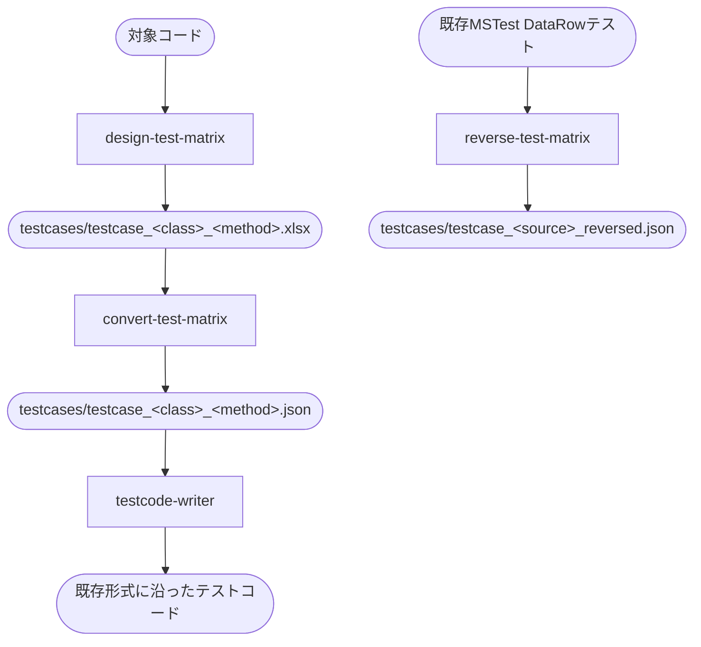

# テスト設計ツール

コードからテストケースを設計し、Excel・JSON・テストコードへ段階的に反映するCodex向けカスタムエージェント集です。各プロジェクトへ `.codex/` を手動配置して利用します。

## 配置

このリポジトリの `.codex` フォルダを対象プロジェクトのルートへコピーします。

```text
target-project/
├── .codex/
│   ├── agents/
│   │   ├── design-test-matrix.toml
│   │   ├── convert-test-matrix.toml
│   │   ├── testcode-writer.toml
│   │   └── reverse-test-matrix.toml
│   └── scripts/
│       ├── workbook_excel_to_json.py
│       ├── validate_workbook_json.py
│       ├── testcode_to_workbook_json.py
│       └── requirements.txt
└── AGENTS.md
```

Excel変換にはPythonと `openpyxl` が必要です。

```bash
python3 -m pip install -r .codex/scripts/requirements.txt
```

対象プロジェクトに既存の `.codex` がある場合は、フォルダ全体を上書きせず `agents/` と `scripts/` の内容をマージしてください。`AGENTS.md` の運用ルールも必要に応じて対象プロジェクトへ追記します。

## エージェント一覧

| エージェント | 入力 | 出力 |
| --- | --- | --- |
| `design-test-matrix` | コードまたはフォルダ | `testcases/testcase_*.xlsx` |
| `convert-test-matrix` | `testcases/testcase_*.xlsx` | 同名の `.json` |
| `testcode-writer` | `testcases/testcase_*.json` | テストコード |
| `reverse-test-matrix` | MSTest DataRowコード | `testcases/testcase_*_reversed.json` |

## 基本ワークフロー

各工程は独立しており、自動では連鎖しません。Codexへエージェント名と対象パスを明示します。

```text
design-test-matrix エージェントに src/TicketService.cs のテストケースExcelを作成させてください。
```

```text
convert-test-matrix エージェントに testcases/testcase_ticketservice_resolveexpected.xlsx をJSONへ変換させてください。
```

```text
testcode-writer エージェントに testcases/testcase_ticketservice_resolveexpected.json からテストを実装させてください。
```

既存テストをマトリクス化する場合は次のように依頼します。

```text
reverse-test-matrix エージェントに src/Example.Tests/TicketServiceTests.cs をJSONへ逆生成させてください。
```


```mermaid
flowchart TD
    A(["対象コード"]) --> B["design-test-matrix"]
    B --> C(["testcases/testcase_&lt;class&gt;_&lt;method&gt;.xlsx"])
    C --> D["convert-test-matrix"]
    D --> E(["testcases/testcase_&lt;class&gt;_&lt;method&gt;.json"])
    E --> F["testcode-writer"]
    F --> G(["既存形式に沿ったテストコード"])

    H(["既存MSTest DataRowテスト"]) --> I["reverse-test-matrix"]
    I --> J(["testcases/testcase_&lt;source&gt;_reversed.json"])
```

## データ契約

ExcelとJSONは次の2シートを持ちます。

- `因子と水準`
- `テストケース`

`テストケース` の列は `ID`、1列以上の因子列、`expected`、`memo` です。JSONは同じ内容をworkbook形式の `sheets` 配列で表現します。

逆生成では、既存DataRowに実際に現れる値だけから `因子と水準` を復元します。元のテストコードから判定できない未使用水準や設計意図は補完しません。
