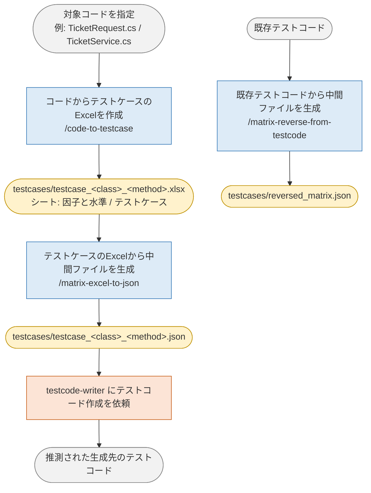

# テスト設計ツール

Codex のスラッシュコマンドとサブエージェントを使って、コードからテストケースを設計し、テストコードへ反映するためのツールです。

このリポジトリは、Codex向けのスラッシュコマンドとサブエージェントのみで運用します。

- スラッシュコマンド用プロンプト: `.codex/prompts/*.prompt.md`
- サブエージェント定義: `.codex/agents/*.agent.md`

## できること

- 指定したコードから因子/水準を抽出し、ペアワイズのテストケースのExcelを作成する
- テストケースのExcelを、テストコード生成用の中間ファイルへ変換する
- 中間ファイルを入力として、サブエージェントにテストコード作成を依頼する
- 既存テストコードからテストケース情報を逆生成する

## 基本の使い方

基本は、スラッシュコマンドで設計・変換を実行し、テストコード作成だけをサブエージェント `testcode-writer` に依頼します。

1. `/code-to-testcase` で、対象コードからテストケースのExcelを作成する
2. `/matrix-excel-to-json` で、テストケースのExcelを中間ファイルへ変換する
3. `testcode-writer` に、中間ファイルからテストコード作成を依頼する

既存テストコードからテストケース情報を取り出したい場合は、`/matrix-reverse-from-testcode` を使います。

## 使い方のイメージ


```mermaid
flowchart TD
    A(["対象コードを指定<br>例: TicketRequest.cs / TicketService.cs"]) --> B["コードからテストケースのExcelを作成<br>/code-to-testcase"]
    B --> C(["testcases/testcase_&lt;class&gt;_&lt;method&gt;.xlsx<br>シート: 因子と水準 / テストケース"])

    C --> D["テストケースのExcelから中間ファイルを生成<br>/matrix-excel-to-json"]
    D --> E(["testcases/testcase_&lt;class&gt;_&lt;method&gt;.json"])

    E --> G["testcode-writer にテストコード作成を依頼"]
    G --> K(["推測された生成先のテストコード"])

    L(["既存テストコード"]) --> M["既存テストコードから中間ファイルを生成<br>/matrix-reverse-from-testcode"]
    M --> N(["testcases/reversed_matrix.json"])

    classDef commandClass fill:#DDEBF7,stroke:#2F75B5,stroke-width:1px;
    classDef fileClass fill:#FFF2CC,stroke:#BF9000,stroke-width:1px;
    classDef agentClass fill:#FCE4D6,stroke:#C65911,stroke-width:1px;
    classDef codeClass fill:#F2F2F2,stroke:#7F7F7F,stroke-width:1px;

    class B,D,M commandClass;
    class C,E,N fileClass;
    class G agentClass;
    class A,K,L codeClass;
```

## スラッシュコマンド

- `/code-to-testcase`: 指定コードの入出力から因子/水準を抽出し、テストケースのExcelを作成する
- `/matrix-excel-to-json`: テストケースのExcelを中間ファイルへ変換する
- `/matrix-sample-excel`: サンプルのテストケースのExcelを作成する
- `/matrix-reverse-from-testcode`: 既存テストコードから中間ファイルを逆生成する

## サブエージェント

- `testcode-writer`: 中間ファイルを唯一の入力として、テストコードを生成・反映する

`testcode-writer` は、因子/水準の再設計やペアワイズ再計算は行いません。設計フェーズはスラッシュコマンドで完了させ、実装フェーズだけを `testcode-writer` に任せます。

## ファイル運用

- テストケースのExcel: `testcases/testcase_<class>_<method>.xlsx`
- 中間ファイル: `testcases/testcase_<class>_<method>.json`
- 逆生成した中間ファイル: `testcases/reversed_matrix.json`

テストケースのExcelは、次の2シート構成です。

- `因子と水準`
- `テストケース`

中間ファイルは、テストケースのExcelと同じ内容を workbook 形式で表現した `.json` 形式のファイルです。通常、利用者が直接編集するものではなく、`testcode-writer` に渡すための入力として扱います。

## 中間ファイル形式

`/matrix-excel-to-json` で作成される中間ファイルは、次の形式です。

```json
{
	"sheets": [
		{
			"name": "因子と水準",
			"columns": ["因子", "水準1", "水準2", "水準3", "備考"],
			"rows": [
				{
					"因子": "Soup",
					"水準1": "塩",
					"水準2": "醤油",
					"水準3": "味噌",
					"備考": "必須"
				}
			]
		},
		{
			"name": "テストケース",
			"columns": ["ID", "Soup", "NoodleThickness", "NoodleAmount", "expected", "memo"],
			"rows": [
				{
					"ID": "TC-001",
					"Soup": "塩",
					"NoodleThickness": "細麺",
					"NoodleAmount": "普通",
					"expected": "200 OK / 食券1",
					"memo": "pairwise(valid)"
				}
			]
		}
	]
}
```
